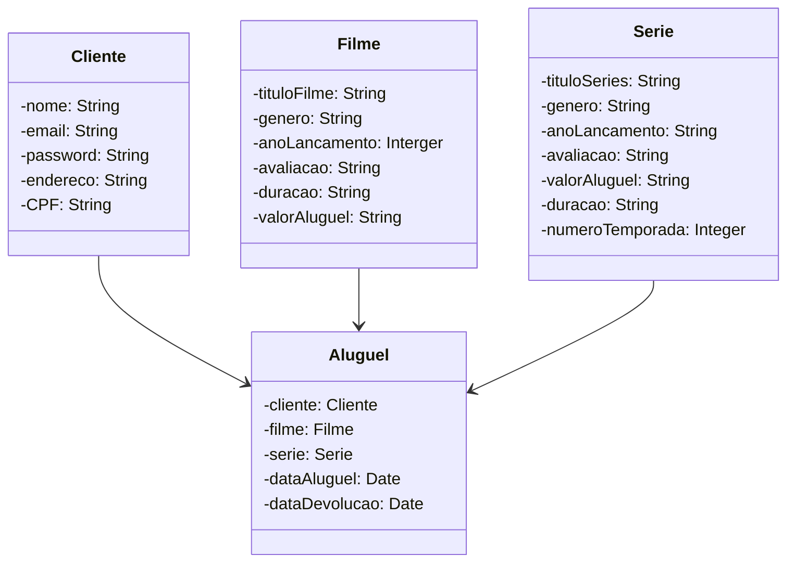

# projetoLumierre_JavaWeb
<<<<<<< HEAD
# javaweb
=======
    +-----------------+                +--------------+            +---------------+
    |     Cliente     |               |    Aluguel     |           |     filmes    |
    +-----------------+                +--------------+            +---------------+
    | - nome          |               | - nome         |          | - tituloFilme   |
    | - email         | <----1 ------>| - filme        |<----1--- | - genero        |
    | - password      |               | - series       |          | -anoLancamento  |
    | - endereco      |               | - dataAluguel  |          | - avaliacao     |
    | - CPF           |               | -dataADevolucao|          | -ValorAluguel   |
    +-----------------+               |                |          | -duracao        |
                                       +--------------+           |                 |
                                                                   +---------------+
                                                                           |
                                                                           |
                                                                    +------------------+
                                                                    |    Series        |
                                                                    +------------------+
                                                                    | - titleSeries    |
                                                                    | - genero         |
                                                                    | - anoLancamento  |
                                                                    | - avaliacao      |
                                                                    | - precoAluguel   |
                                                                    | - duracao        |
                                                                    | - numeroTemporada|
                                                                     +-----------------+

>>>>>>> 394d9f7d0f3495b06d302f58b4b53440c51b4a87
